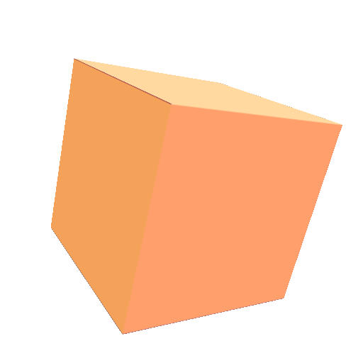
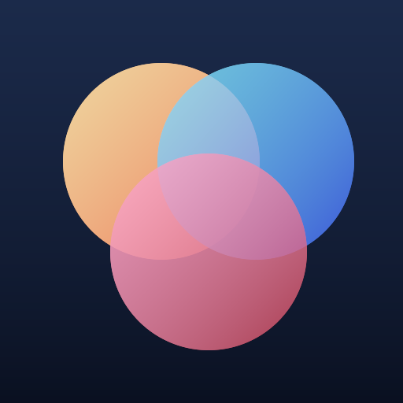

<h1 align="center">svg3</h1>

<p align="center"><b>An extended SVG renderer for 3D models — on the GPU.</b></p>

<p align="center">
  <a href="https://github.com/PupilTong/svg3/actions/workflows/ci.yml"></a>
  <a href="LICENSE"></a>
  
  
</p>

<p align="center">
  
  &nbsp;
  
</p>
<p align="center"><sub>Rendered headlessly by the <code>svg3</code> CLI from the documents in <a href="svg3-skill/examples/"><code>svg3-skill/examples/</code></a>.</sub></p>

---

## What is svg3?

`svg3` is an **opt-in extension to SVG 1.1**. A document is ordinary SVG until
its root `<svg>` carries `extension="pupiltong"`; with that attribute it may
also use three-dimensional graphics elements (`<cube>`, `<ellipsoid>`,
`<cylinder>`, `<surface>`) and 3D transform functions, all rasterised on the GPU
with [wgpu](https://crates.io/crates/wgpu). Without it, the renderer behaves as
a normal SVG renderer and ignores the 3D features.

The document language is specified in [SPEC.md](SPEC.md) (editor's draft).

> **Status: early scaffolding.** The renderer covers a growing subset of SVG 1.1
> plus the svg3 3D primitives (details below). A full web-platform CSS cascade
> (the historical [Stylo](https://crates.io/crates/stylo) direction) is a paused
> roadmap item; styling currently reads presentation attributes and inline
> `style="…"`.

## Quickstart — generate an image

The `svg3-cli` crate installs a headless renderer named **`svg3`** that turns a
document into a PNG:

```sh
# Render one of the bundled demos (perspective camera for the 3D scene):
cargo run -p svg3-cli -- svg3-skill/examples/cube.svg -o cube.png --camera

# …or install the command and use it anywhere:
cargo install --path svg3-cli
svg3 svg3-skill/examples/shapes.svg -o shapes.png
```

A minimal 3D document:

```xml
<svg xmlns="http://www.w3.org/2000/svg" extension="pupiltong" width="512" height="512">
  <cube cx="0" cy="0" cz="0" size="260"
        transform="translate(256 256) rotateY(35deg) rotateX(-22deg)" fill="#e8743b"/>
</svg>
```

```sh
svg3 cube.svg -o cube.png        # → a 512×512 PNG
```

Prefer something interactive? `cargo run -p app-macos` opens a native macOS
window where you can paste SVG text and watch it render.

## Generate images from your AI coding agent

The [`svg3-skill/`](svg3-skill/) directory is a portable **agent skill**: drop
it into your coding agent (e.g. Claude Code's skills directory) and it teaches
the agent to author a document, render it with the `svg3` CLI, view the PNG, and
iterate — so "make me an image of …" becomes a tight author → render → look
loop. See [`svg3-skill/SKILL.md`](svg3-skill/SKILL.md).

## Features

**2D (SVG 1.1)**

- Shapes & strokes: `<rect>`, `<circle>`, `<ellipse>`, `<polygon>`,
  `<polyline>`, `<line>`, `<path>` — fills and strokes with caps, joins, dashes,
  `pathLength` calibration, opacity, and referenced markers.
- Paint servers: `<linearGradient>`, `<radialGradient>`, and rectangular-tile
  `<pattern>`.
- Filters: a GPU pass per primitive across the full `<fe…>` chain
  (`feGaussianBlur`, `feColorMatrix`, `feTurbulence`, `feDiffuse`/
  `feSpecularLighting`, `feDisplacementMap`, `feImage`, `feDropShadow`,
  `feMorphology`, `feConvolveMatrix`, `feComponentTransfer`, `feFlood`, …).
- `<clipPath>` and `<mask>` (luminance or alpha) via GPU mask passes.
- Nested `<svg>` viewports with `viewBox` / `preserveAspectRatio` and overflow
  clipping.

**3D (svg3, with `extension="pupiltong"`)**

- Primitives: `<cube>`, `<ellipsoid>`, `<cylinder>`, and `<surface>`,
  tessellated and drawn through a depth-aware pipeline.
- 3D transforms: `translate3d`, `translateZ`, `scale3d`, `scaleZ`, `rotateX`,
  `rotateY`, `rotateZ`, `rotate3d`, `matrix3d`.
- Depth-correct compositing of 2D and 3D content (greater Z occludes lesser Z).
- A nested `<svg>` as a **texture paint server** on a 3D primitive, wrapped over
  the faces via `cube-map` (`same` / `cross`) and the per-primitive UV maps.

## The svg3 language

The user coordinate system gains a Z axis (left-handed: +X right, +Y down, +Z
toward the viewer); SVG 1.1 content lives in the plane `z = 0`. The 3D transform
functions may be mixed with SVG 1.1 transforms in a single `transform`
attribute. The viewing transformation (camera) is supplied by the renderer and
is not addressable from the document. Full details in [SPEC.md](SPEC.md).

## Pipeline

```
svg3 XML   ──►  svg3::dom    ──►  svg3::render ──►  PNG / GPU surface
(text)          (element tree)    (wgpu draw)
```

A Stylo-driven `svg3::style` cascade is a paused roadmap item; until it lands,
presentation attributes and inline `style="…"` are read directly in
`svg3::render`.

## Workspace

| Crate       | Responsibility                                                       |
|-------------|----------------------------------------------------------------------|
| `svg3`      | The library: `dom` (parse svg3/SVG XML into an element tree) and `render` (turn a parsed document into GPU draw calls and a headless image). |
| `svg3-cli`  | The headless `svg3` command — render a document to a PNG. |
| `app-macos` | Native macOS demo (`svg3-macos`): paste SVG text and render it in a wgpu window. |

## Build & run

The Rust toolchain is pinned in [`rust-toolchain.toml`](rust-toolchain.toml)
(`nightly-2026-04-20`); `rustup` selects it automatically inside this repo.

```sh
cargo build --workspace          # first build is slow (wgpu)
cargo test  --workspace
cargo fmt --check
cargo clippy --workspace --all-targets --all-features -- -D warnings

cargo run -p svg3-cli -- input.svg -o out.png   # headless render to PNG
cargo run -p app-macos                          # interactive macOS demo
bash scripts/bundle-macos.sh                     # build target/release/bundle/svg3-macos.app

cargo bench --workspace                          # criterion benches (codspeed-instrumented)
```

## Roadmap

1. **(done)** winit event loop + wgpu surface — the macOS demo renders pasted SVG.
2. **(done)** svg3/SVG XML parsing → element tree.
3. **(done)** 2D shapes, strokes, gradients, patterns, markers, filters,
   `clipPath`/`mask`, nested viewports, and headless image output.
4. **(done)** 3D primitive mesh generation and depth-aware 2D/3D compositing,
   including nested-SVG texture paint servers.
5. **(paused)** Stylo CSS cascade — computed styles drive material/transform.
6. Multi-platform native demos (Windows, Linux) + Linux/Windows CI.
7. Native macOS `.app` bundling.

## Contributing

See [AGENTS.md](AGENTS.md) for toolchain, build/test/lint commands, and
conventions (this repo collaborates with multiple AI agents through that single
canonical guide).

## License

[MPL-2.0](LICENSE).
